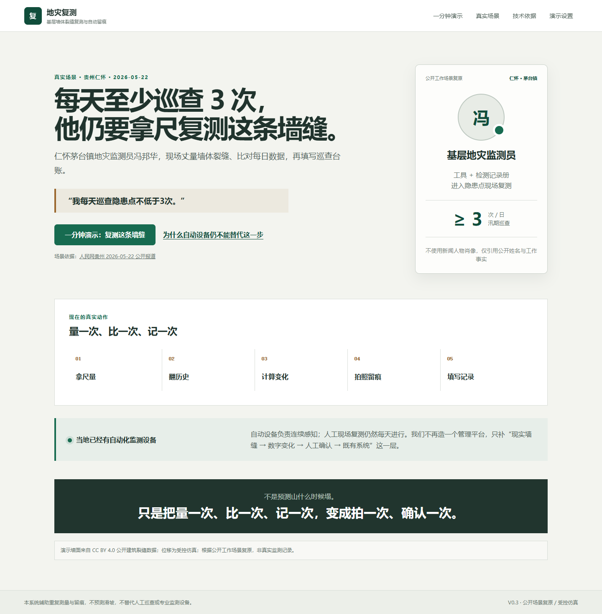
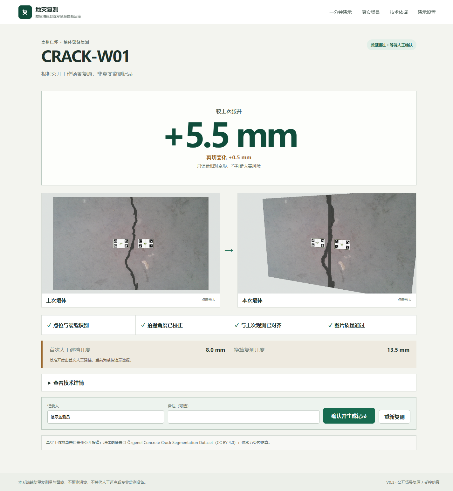
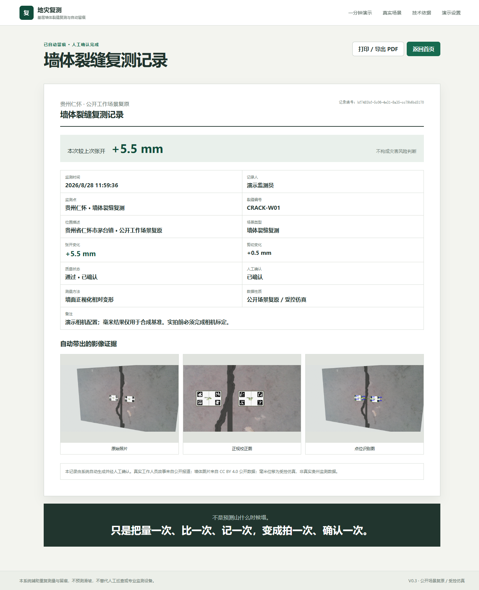

# GeoRecheck · 地灾复测

> 面向基层地灾巡查的视觉复测与自动留痕 PoC

A local proof-of-concept for visual crack re-measurement and inspection record generation in grassroots geohazard monitoring.

GeoRecheck 聚焦一个具体动作：基层人员在固定墙缝两侧布设低成本视觉复测贴，拍摄照片后自动完成点位识别、拍摄角度修正、多期相对变形测量、质量门控和记录生成，再由人员确认。

它不是滑坡预测系统，不进行地灾风险判断，也不替代专业自动化监测设备或基层监测员。

## Demo Preview



| 相对张开结果 | 人工确认后的自动记录 |
|---|---|
|  |  |

## Why

贵州公开报道中的基层地灾监测员需要反复执行：丈量墙体裂缝、比对每日监测数据、填写巡查台账；当地同时已经部署自动化监测设备。因此 GeoRecheck 不再造一个管理平台，而只处理人工巡查中的固定点视觉复测：

**measure → compare → record**

真实岗位依据：[人民网贵州《常态化巡查、智慧化监测！贵州仁怀：筑牢汛期地质灾害安全防线》](https://gz.people.com.cn/n2/2026/0522/c361324-41588761.html)。

## Demo

```text
Photo
  → Fiducial Detection
  → Perspective / Pose Correction
  → Relative Deformation Measurement
  → Quality Gate
  → Human Confirmation
  → Inspection Record
```

主界面输出“较上次张开 +X mm”和可选剪切变化。视觉板中心绝对距离、PnP RMSE 等只在折叠技术详情中提供。

## Current Status

当前版本：**V0.3 hackathon demo**。

已完成：

- 本地浏览器 Demo、照片上传与摄像头入口；
- OpenCV fiducial detection；
- 墙面 metric rectification 与相对变形测量；
- 图片质量门控与失败拒绝；
- 原始图、识别图和正视校正图证据；
- 人工确认、SQLite 持久化和复测记录；
- 受控墙面仿真与 Planar / Dual PnP A/B；
- pytest、Vite build、Playwright 和连续 10 次 Golden Path 回归。

尚未完成：

- 实体复测贴尺寸与贴装验证；
- 真实相机标定后的 0/2/5/10 mm 物理位移实验；
- 室外光照、距离、角度与长期贴装测试；
- 真实基层监测员 shadow mode。

## Validation

在 58 个预期可接受的受控合成墙面场景上，当前 Golden Path 方法 `planar_rectified_2d` 得到：

- MAE：**0.496 mm**
- P95：**1.002 mm**
- Failure rate：**0%**

**These values only represent controlled synthetic experiments and must not be interpreted as field accuracy.**

完整逐案例数据见 [`artifacts/validation_v03/`](artifacts/validation_v03/)，验证边界见 [`docs/VALIDATION.md`](docs/VALIDATION.md)。

## Architecture

- Frontend: React, TypeScript, Vite
- API: FastAPI
- Vision: OpenCV fiducials, metric rectification, relative deformation, quality gating
- Storage: SQLite
- Regression: pytest, Playwright

毫米结果由确定性几何算法产生。可选 AI 裂缝分割未接入主链路，也不会参与毫米值或风险判断。

## Running locally

Windows 10/11、Python 3.11、Node.js 20+：

```bat
git clone https://github.com/lansijian/geo-recheck.git
cd geo-recheck
scripts\setup_windows.cmd
scripts\run_dev.cmd
```

打开 <http://127.0.0.1:5173>。

`setup_windows.cmd` 默认在仓库内创建 `.venv`，安装依赖，并从官方来源下载约 711 MiB 的墙面裂缝数据以生成受控演示场景。已有 Python 环境可通过 `GEORECHECK_PYTHON` 环境变量指定。

常用验证命令：

```bat
.venv\Scripts\python.exe -m pytest -q
npm run build --prefix frontend
npm run e2e --prefix frontend
```

## Data & Attribution

### Özgenel Concrete Crack Segmentation Dataset

- Source: <https://data.mendeley.com/datasets/jwsn7tfbrp/1>
- DOI: `10.17632/jwsn7tfbrp.1`
- License: CC BY 4.0
- Usage: only used to generate controlled wall-crack demo scenes. The original dataset is not redistributed in this repository.

### CrackForest

- Source: <https://github.com/cuilimeng/CrackForest-dataset>
- Usage: legacy regression experiments only; it is not used by the V0.3 Golden Path.

数据边界：

- **REAL:** 公开报道中的基层监测员工作流程；
- **PUBLIC DATA:** 公开建筑/混凝土裂缝图片；
- **SYNTHETIC:** 复测贴布设、首次开度、张开/剪切位移、相机变换和 Demo 毫米结果。

任何公开裂缝图片都不应被理解为真实贵州监测数据。更多说明见 [`THIRD_PARTY_NOTICES.md`](THIRD_PARTY_NOTICES.md)。

## Safety & Scope

GeoRecheck does not provide geohazard risk assessment, warning, evacuation decisions or safety guarantees.

所有测量结果必须由受过培训的人员复核。本项目不能替代人工现场巡查、专业裂缝监测设备或现有地灾业务系统。

## License

项目自有源代码使用 [MIT License](LICENSE)。第三方数据、由第三方数据产生的演示媒体以及引用材料不属于 MIT 授权范围，继续适用其各自许可证与署名要求。
