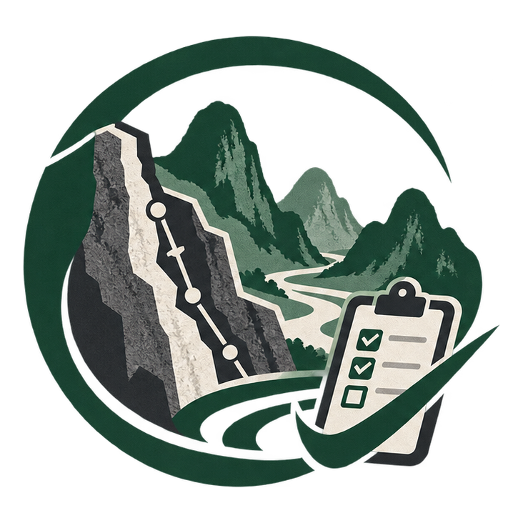
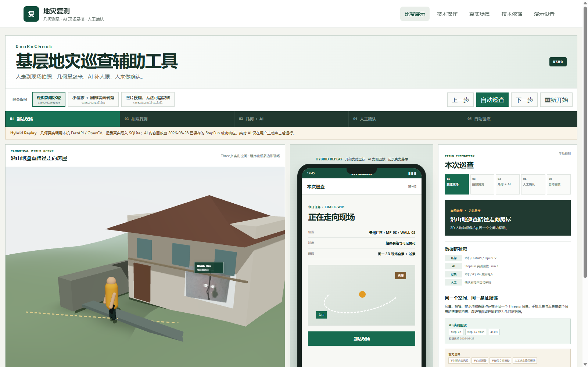
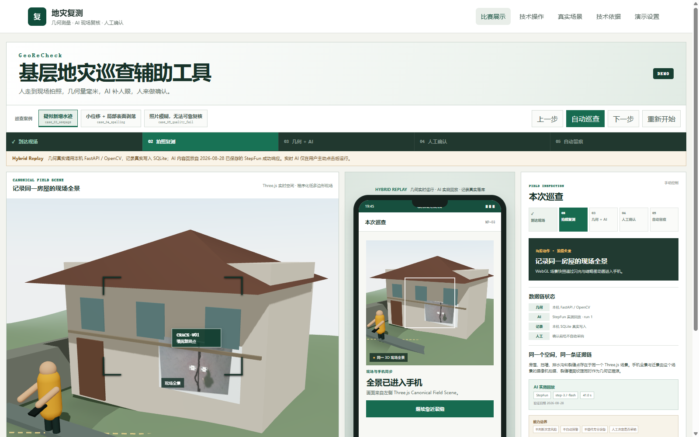
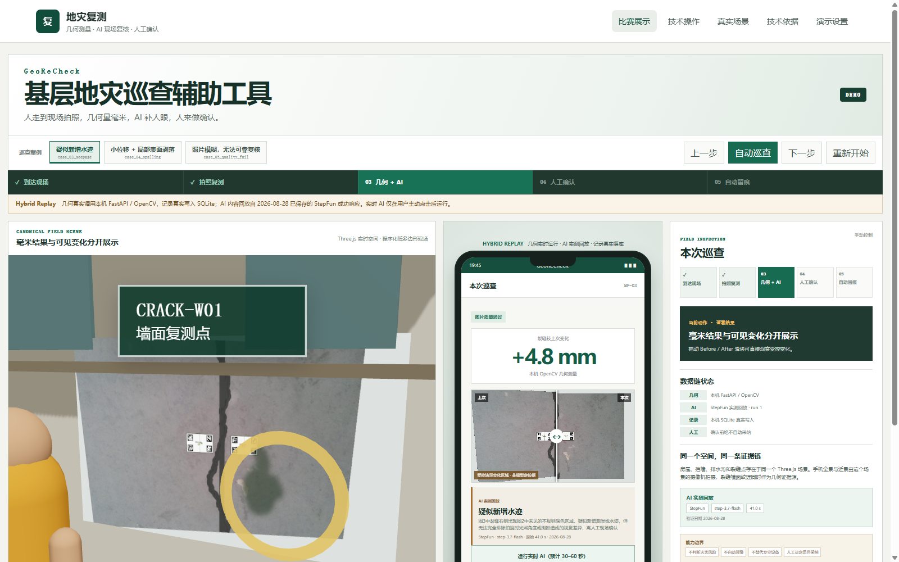
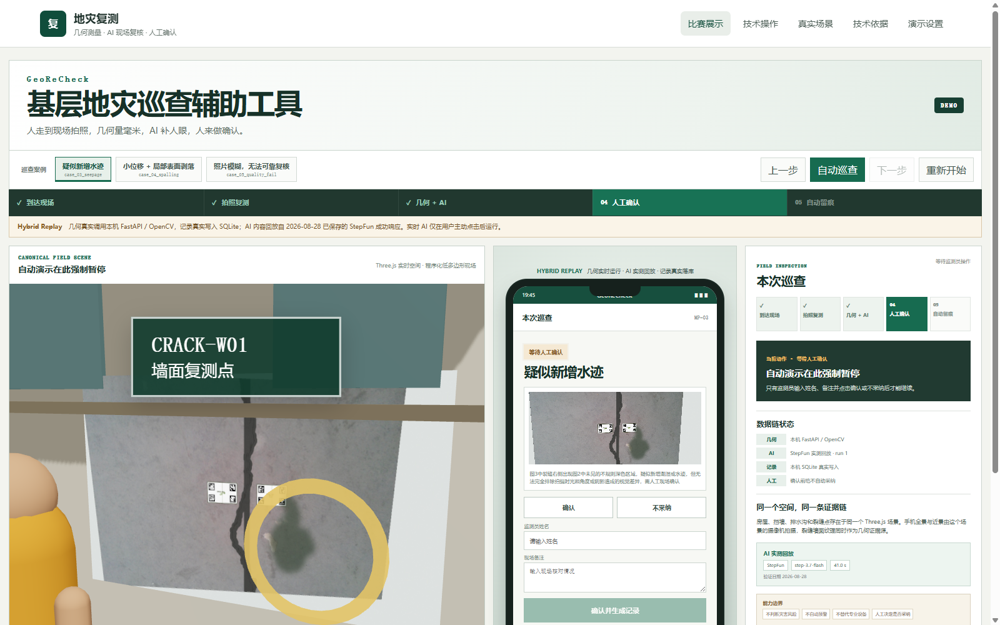
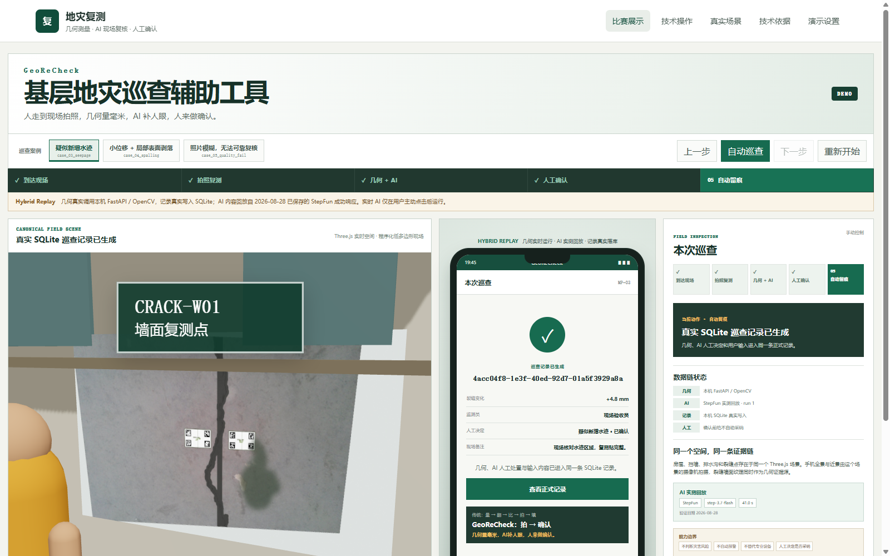
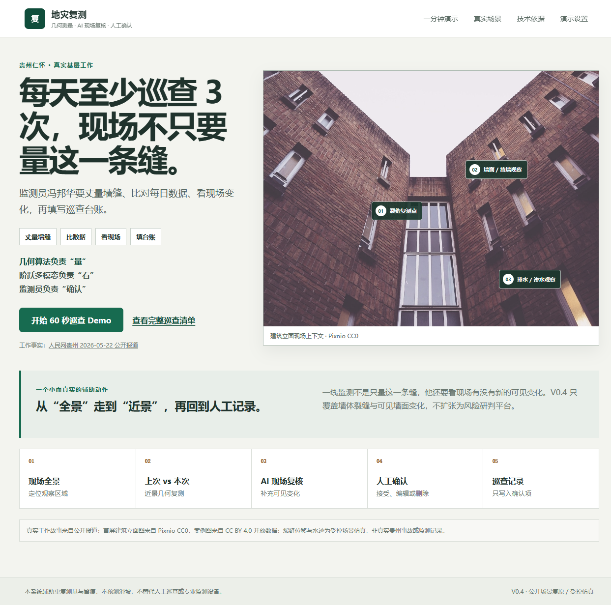
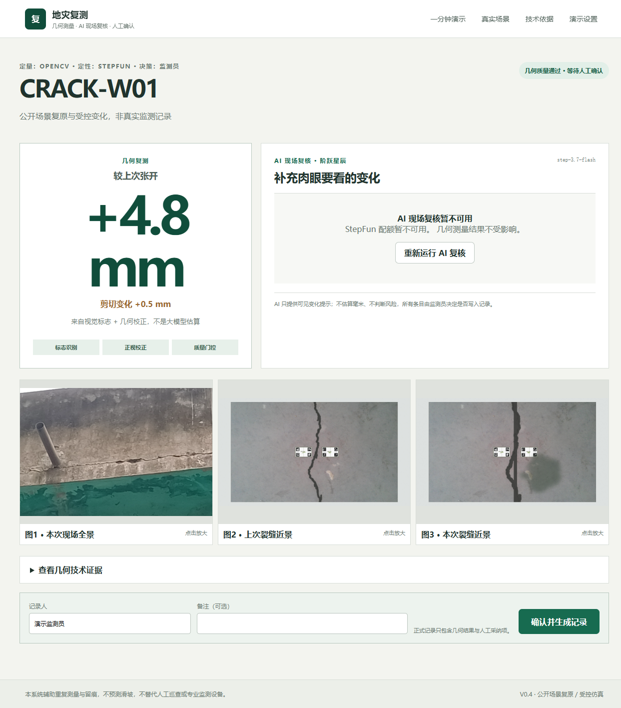
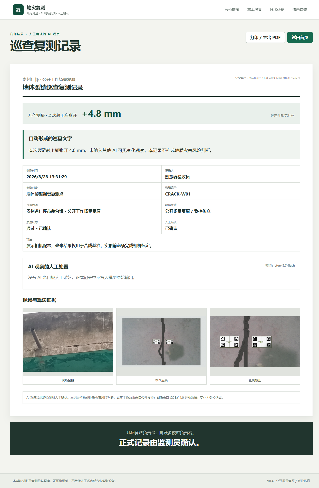

# GeoRecheck · 地灾复测

<p align="center">
  
</p>

> 面向基层地灾巡查的视觉复测与自动留痕 PoC

A local proof-of-concept for visual crack re-measurement and inspection record generation in grassroots geohazard monitoring.

当前版本：V0.6 Field Inspector Simulator。几何算法负责“量”，阶跃多模态负责“看”，监测员负责“确认”，GeoReCheck 负责把证据留在同一条记录里。

GeoRecheck 是一个 Windows 本地 Demo：基层监测员拍摄现场全景与裂缝近景后，系统先用确定性视觉几何计算相对张开，再用 StepFun 多模态模型辅助比较可见水迹、表面剥落、复测标志与图像覆盖，最后由监测员逐条确认并生成巡查记录。

它不预测滑坡，不判断是否安全，不输出风险等级、预警或撤离建议，也不替代人工巡查和专业监测设备。

## V0.6 现场巡查模拟器

打开 `/showcase` 可进入三栏现场模拟：左侧是由 React Three Fiber 驱动的统一三维现场，中间是巡查员手机操作，右侧同步解释证据链与职责边界。默认展示 `case_03_seepage`，也可切换剥落和图片质量失败案例，支持自动演示、暂停、上一步、下一步与重置。

```bat
一键启动前后端.cmd
```

该脚本固定使用 `D:\Anaconda\_envs\PulseWeave\Scripts\python.exe`，等待前后端就绪后用 Google Chrome 自动打开 <http://127.0.0.1:5173/showcase>。这样可以避开联想浏览器对本地页面注入隐藏扩展脚本造成的控制台噪声。

- **Hybrid Replay（默认）**：每次真实调用本机 FastAPI/OpenCV 生成几何测量并写入 SQLite；AI 部分回放仓库中成功的 StepFun 实测响应，同时保存为本次巡查的待确认条目；
- **实时 AI（显式可选）**：只有点击“运行实时 AI”才会请求 StepFun，失败时仍保留 OpenCV 几何结果；
- 自动播放在“等待人工确认”处停止，不会替监测员填写姓名、备注或作出决定；
- `showcase.json` 由验证结果、案例元数据和真实 AI 响应统一生成，页面不手写几何数值或 AI 结论。

| 三维现场行走 | 手机采集同一现场 |
|---|---|
|  |  |

| AI 辅助复核 | 人工确认 | 正式留痕 |
|---|---|---|
|  |  |  |

完整架构、数据链和验收说明见 [`docs/V0_6_FIELD_SIMULATOR.md`](docs/V0_6_FIELD_SIMULATOR.md)。

## 60 秒主链路

```text
现场全景 + 上次近景 + 本次近景
                 │
        ┌────────┴────────┐
        │                 │
  OpenCV 几何测量      StepFun 多模态复核
  相对张开 +4.8 mm     可见水迹 / 剥落 / 覆盖
        │                 │
        └────────┬────────┘
                 │
            监测员确认
                 │
             巡查记录
```



| 几何结果与 AI 失败隔离 | 人工确认后的记录 |
|---|---|
|  |  |

## V0.6 已实现

- 保留 V0.3 的 React/TypeScript/Vite、FastAPI、AprilTag、metric rectification、相对变形、质量门控、证据、SQLite 与人工确认；
- 5 个有明确来源和受控变化说明的 Demo Cases：稳定、张开、水迹、剥落、质量失败；
- 12 张 CC BY 4.0 真实墙体场景，以及 1 张 CC0 建筑立面上下文图；
- StepFun 三图输入，顺序固定为现场全景、上次近景、本次近景，`detail=high`；
- JSON 首对象提取、Pydantic 枚举校验、越权措辞拒绝、最多一次格式重试；
- AI timeout、network、quota、model unavailable 均不会阻塞几何结果；
- AI 条目状态 `pending / accepted / rejected / edited`，正式记录只写入人工接受或编辑项；
- 结果刷新后从 SQLite 恢复最新 AI 复核与人工处置状态。
- `/showcase` 三栏现场模拟页、13 个内部状态映射为 5 个对外步骤、自动/手动播放控制；
- 程序化低多边形地形、房屋、挡墙、排水沟、路径、裂缝点与巡查员，真实驱动人物、相机、闪光和照片飞入手机；
- 三个案例的一键切换，以及 Hybrid Replay 与实时 AI 的严格披露；
- Before/After 滑块、受控 ROI 披露、真实姓名/备注/人工决定与正式记录持久化；
- 演示案例的上次/本次近景使用不同拍摄角度，仍由复测标志和透视校正完成几何复测。

默认模型通过环境变量配置，本地当前验证使用 `step-3.7-flash`，代码没有硬编码为唯一模型。

## 本地运行

macOS 启动与验证说明见 [docs/MACOS.md](docs/MACOS.md)。

Windows 10/11、Node.js 20+、Python 3.11+：

```bat
git clone https://github.com/lansijian/geo-recheck.git
cd geo-recheck
scripts\setup_windows.cmd
scripts\run_dev.cmd
```

`setup_windows.cmd` 默认在项目目录创建 `.venv`。如需使用已有 Python 环境，可先将 `GEORECHECK_PYTHON` 设置为该环境的 `python.exe`，脚本不会依赖特定盘符或用户名。

打开 <http://127.0.0.1:5173/showcase>。如需原 V0.4 技术操作页，打开 <http://127.0.0.1:5173/capture?demo=1&case=case_03_seepage>。

StepFun 仅从被 Git 忽略的 `.env.local` 读取密钥：

```bat
copy .env.example .env.local
notepad .env.local
```

```dotenv
STEPFUN_API_KEY=
STEPFUN_BASE_URL=https://api.stepfun.com/step_plan/v1
STEPFUN_MODEL=step-3.7-flash
STEPFUN_TIMEOUT_SECONDS=180
STEPFUN_AI_REVIEW_ENABLED=false
```

Step Plan 密钥必须使用上面的 `/step_plan/v1` 地址；普通 Open API 密钥则使用 `https://api.stepfun.com/v1`。两者的额度通道相互独立，不能用普通 Open API 的账户余额判断 Step Plan 剩余额度。密钥不会通过 `/api/ai/status`、SQLite 或日志返回。没有密钥时几何主链路仍完整可用。

## 验证

```bat
set GEORECHECK_PYTHON=.venv\Scripts\python.exe
%GEORECHECK_PYTHON% -m pytest -q
npm run typecheck --prefix frontend
npm run build --prefix frontend
npm run e2e --prefix frontend
```

真实 StepFun 三图 smoke test 只在显式配置密钥后执行：

```bat
%GEORECHECK_PYTHON% scripts\test_stepfun_vision.py
set RUN_STEPFUN_LIVE_TEST=1
%GEORECHECK_PYTHON% scripts\run_ai_validation_v04.py
```

脚本会把可审计结果写入 `artifacts/stepfun_v04/live_smoke.json` 和 `artifacts/ai_validation_v04/`。2026-08-28 的 `step-3.7-flash` Step Plan 实测为：15/15 调用及 JSON 解析成功、预期现象命中 13/15、含额外正向条目的运行 1/15、中位延迟 42.7 秒。它们只是 5 个受控 Demo Cases 的结果，不是通用准确率。配额、网络或模型失败会明确标记为失败，不会用 fixture 冒充真实成功。离线 pytest 使用 `backend/tests/fixtures/stepfun_response.json` 验证解析、Pydantic、人工处置和记录生成。

V0.3 的受控几何验证结果仍保留在 `artifacts/validation_v03/`；这些数值只代表合成实验，不代表野外精度。

V0.4 的逐项验收状态与 live/offline 证据边界见 [`docs/V0_4_COMPLETION_AUDIT.md`](docs/V0_4_COMPLETION_AUDIT.md)。

## Data & Attribution / 数据与来源边界

- `REAL STORY`：人民网贵州公开报道中的基层监测员岗位与工作动作；
- `PUBLIC DATA`：Özgenel Concrete Crack Segmentation Dataset（[Mendeley Data](https://data.mendeley.com/datasets/jwsn7tfbrp/1)，CC BY 4.0）仅用于生成受控墙体裂缝演示场景，原始 745 MB 数据集不在仓库中分发；
- `LEGACY PUBLIC DATA`：[CrackForest](https://github.com/cuilimeng/CrackForest-dataset) 仅用于旧版回归实验，完整数据集不在仓库中分发；
- `OPEN IMAGE`：另有 12 张 Mendeley CC BY 4.0 墙体场景图像与 1 张 Pixnio CC0 建筑立面图；
- `SYNTHETIC`：复测贴、首次开度、张开/剪切、水迹、剥落、模糊与 Demo 毫米结果；
- `NOT REAL GUIZHOU DATA`：所有案例均不是贵州真实事故或生产监测记录。

详细文件级来源见 [`data/curated_scene_library/manifest.json`](data/curated_scene_library/manifest.json)、各案例 `metadata.json` 和 [`THIRD_PARTY_NOTICES.md`](THIRD_PARTY_NOTICES.md)。

## 当前未完成的真实世界验证

- 实体复测贴尺寸与贴装验证；
- 真实相机标定后的 0/2/5/10 mm 物理位移实验；
- 室外光照、距离、角度与长期贴装测试；
- 真实基层监测员 shadow mode。

## Safety & Scope

GeoRecheck does not provide geohazard risk assessment, warning, evacuation decisions or safety guarantees. All measurements must be reviewed by trained personnel. 本项目不能替代专业自动化监测设备、基层监测员或正式安全决策流程。

## License

项目自有源代码使用 [MIT License](LICENSE)。第三方图像及其派生演示媒体不属于 MIT 授权范围，继续适用各自许可证与署名要求。
